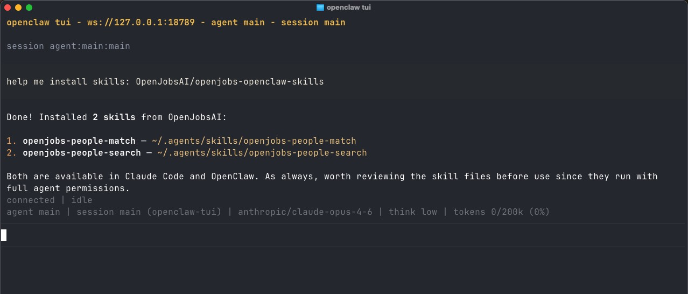

# OpenJobs AI — OpenClaw Skills

A collection of [OpenClaw](https://github.com/clawdbot/openclaw) skills for recruiting and talent sourcing, powered by the [OpenJobs AI](https://www.openjobs-ai.com/).

## What are OpenClaw Skills?

OpenClaw skills are Markdown-based instruction files that extend AI assistants (like Claude) with domain-specific capabilities. Each skill teaches the AI how to interact with a specific API or workflow.

## Skills

### 🔍 [openjobs-people-search](./skills/openjobs-people-search/SKILL.md)

Search, discover, and retrieve professional candidate profiles using OpenJobs AI. Supports structured search, profile lookup, candidate comparison, talent analytics, and contact info unlock.

**Capabilities:**
- Search candidates using structured filters (skills, location, experience, industry, etc.)
- Look up full profiles by LinkedIn URL (up to 50 at once)
- Compare multiple candidates side by side
- Analyze talent pool statistics and distributions
- Unlock candidate contact information (email addresses)

---

### 🎯 [openjobs-people-match](./skills/openjobs-people-match/SKILL.md)

Evaluate candidate-job fit using OpenJobs AI. Grade a single CV against a job description or bulk-grade multiple candidates and rank them by match score.

**Capabilities:**
- Score a single candidate CV against a job description (0–100 rating)
- Bulk-grade up to 20 LinkedIn profiles against one JD and rank by fit score

---

## Installation

### Recommended: npx skills (multi-agent client friendly)

Install all skills at once:

```bash
npx skills install OpenJobsAI/openjobs-openclaw-skills
```

### Claude Code

Via terminal:

```bash
claude plugin marketplace add OpenJobsAI/openjobs-openclaw-skills
```

Or inside Claude Code:

```
/plugin marketplace add OpenJobsAI/openjobs-openclaw-skills
```

### ClawhHub

```bash
clawhub install openjobs-people-match
clawhub install openjobs-people-search
```

Or just tell OpenClaw directly:

> "Install skills: OpenJobsAI/openjobs-openclaw-skills"



## Requirements

- A **Mira API key** (`mira_...`) from [platform.openjobs-ai.com](https://platform.openjobs-ai.com/)

## License

Apache 2.0
