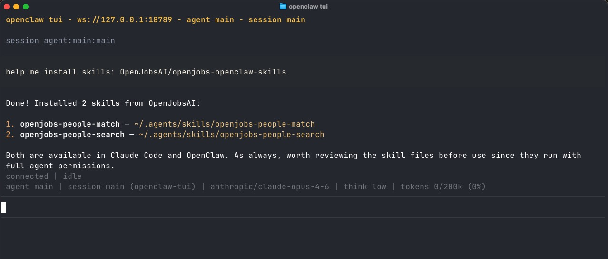

# Metix AI OpenClaw Skills

OpenClaw skills for recruiting, talent sourcing, job search, company discovery, candidate matching, and academic researcher discovery, powered by [Metix AI](https://www.metix.ai/).

Built for **Mira API `2.1.2`** at `https://mira-api.metix.ai`.

## Install the Skills

Install the repository once when your client supports repository installs. This installs the platform assistant plus all public domain skills together:

```bash
npx skills install OpenJobsAI/openjobs-openclaw-skills
```

### Codex

Codex reads user-level skills from `$HOME/.agents/skills`. If the universal installer is not available in your setup, install manually:

```bash
git clone https://github.com/OpenJobsAI/openjobs-openclaw-skills.git
mkdir -p "$HOME/.agents/skills"
cp -R openjobs-openclaw-skills/skills/* "$HOME/.agents/skills/"
```

Restart Codex if needed, then run `/skills` or type `$openjobs-people-search` to verify that the Metix AI skills are available.

### Claude Code

```bash
claude plugin marketplace add OpenJobsAI/openjobs-openclaw-skills
```

or inside Claude Code:

```text
/plugin marketplace add OpenJobsAI/openjobs-openclaw-skills
```

ClawHub installs one skill at a time. Install the platform assistant first, then add domain skills if your ClawHub client does not support repository installs:

```bash
clawhub install openjobs-platform-assistant
clawhub install openjobs-people-search
clawhub install openjobs-people-match
clawhub install openjobs-jobs-search
clawhub install openjobs-company-search
clawhub install openjobs-ai-talent-search
```

Or ask an OpenClaw-compatible agent:

```text
Install skills: OpenJobsAI/openjobs-openclaw-skills
```



## Quick Start

1. Get a Mira API key from [platform.metix.ai](https://platform.metix.ai/).
2. Configure `MIRA_KEY` in the environment that starts your agent. See [Configure MIRA_KEY](#configure-mira_key).
3. Restart the agent after changing environment variables or client secrets.
4. Ask the agent to use one of the Metix AI skills, for example:

```text
Find US data engineers with Python, AWS, and startup experience.
```

```text
Find senior frontend jobs in New York and fetch the job details.
```

```text
Find privately held AI companies in the United States and fetch company details.
```

The agent should verify that `MIRA_KEY` is present, check `GET /version`, then call the documented Mira API endpoints. Do not paste a real API key into chat, issues, pull requests, README files, screenshots, or shared config.

## Skills

| Skill | Use when |
|---|---|
| [`openjobs-platform-assistant`](./skills/openjobs-platform-assistant/SKILL.md) | Default entrypoint for outcome-oriented workflows: rank hiring companies, enrich company/profile/job/scholar data, match candidates, and unlock final selected contacts. |
| [`openjobs-people-search`](./skills/openjobs-people-search/SKILL.md) | Search professional candidates, fetch profile details, compare candidates, or unlock contact info. |
| [`openjobs-people-match`](./skills/openjobs-people-match/SKILL.md) | Grade one CV against a job description or bulk-rank LinkedIn profiles against one JD. |
| [`openjobs-jobs-search`](./skills/openjobs-jobs-search/SKILL.md) | Search jobs by title, company, location, seniority, industries, functions, and fetch full job details. |
| [`openjobs-company-search`](./skills/openjobs-company-search/SKILL.md) | Search companies by name, type, industry, size, headquarters address, B2B flag, and fetch company details. |
| [`openjobs-ai-talent-search`](./skills/openjobs-ai-talent-search/SKILL.md) | Search academic scholars by affiliation, research areas, citations, h-index, publications, education, and position. |

## API Model

Mira API `2.1.2` is ID-first for people, jobs, and companies:

1. Search returns string IDs:
   - `POST /v1/people-search`
   - `POST /v1/people-fast-search`
   - `POST /v1/job-fast-search`
   - `POST /v1/company-fast-search`
2. Detail endpoints fetch full records:
   - `POST /entity/v1/profiles/detail-by-id`
   - `POST /entity/v1/profiles/detail-by-linkedin-url`
   - `POST /entity/v1/jobs/detail-by-id`
   - `POST /entity/v1/companies/detail-by-id`

Public API keys can request up to `1000` search results and up to `100` IDs or URLs per detail request. Scholar search (`POST /v1/scholar-fast-search`) returns scholar documents directly.

Metered endpoints preflight quota before downstream work. For example, `people-unlock` accepts up to `10` LinkedIn URLs per request, requires enough quota for `200 * len(linkedin_urls)` before calling the unlock service, and charges only returned contacts as `200 * unlocked_count`.

Quota cost per public operation (charged only on a billable result; `402` is returned up front if quota is insufficient):

| Operation | Quota points |
|---|---|
| `POST /v1/people-search` | `10` |
| `POST /v1/people-fast-search` | `5` |
| `POST /v1/job-fast-search`, `POST /v1/company-fast-search` | `5` |
| `POST /v1/scholar-fast-search` | `3` |
| Any entity detail endpoint | `3` (when `found > 0`, batch max `100`) |
| `POST /v1/people-compare` | `2` |
| `POST /v1/people-grade` | `2` |
| `POST /v1/people-bulk-grade` | `2 * total_requested` |
| `POST /v1/people-unlock` | `200 * unlocked_count` (max `10` URLs) |
| `GET /version`, `GET /auth/key/status` | free |

Data freshness differs by entity type:

- Profile data is refreshed quarterly and this skill set is aligned to the `202603` profile snapshot.
- Job data is daily active, real application data. A job ID previously returned by search may later be `not_found` if the posting is no longer active.
- Company data is refreshed quarterly and this skill set is aligned to the `202603` company snapshot.

## Safety Boundary

These public skills should use only the endpoints documented in this repository. People search, profile detail, and candidate evaluation must stay on job-relevant fields. Do not search, filter, aggregate, rank, or present candidates by restricted demographic attributes such as age, gender, ethnicity, sex, race, or similar protected classes.

Use job-relevant alternatives such as skills, experience, role, industry, location, education, language, and certifications.

Skills must not self-update, overwrite local instruction files, execute remote Markdown, or import remote instructions at runtime. `GET /version` is compatibility metadata only.

## Configure `MIRA_KEY`

`MIRA_KEY` must be available to the agent process as an environment variable or through the agent client's own secret mechanism. The variable name must be exactly `MIRA_KEY`.

Safe presence check:

```bash
test -n "${MIRA_KEY:-}" && echo "MIRA_KEY is set" || echo "MIRA_KEY is missing"
```

This check does not print the key. If it reports missing, configure the key outside the chat session and restart the agent.

### Terminal-launched agents

Use this for Codex CLI, Claude Code, or another CLI agent launched from your shell. Replace `mira_***` with the real key in your terminal, then start the agent from that same terminal:

```bash
export MIRA_KEY='mira_***'
codex  # or claude
```

This setting lasts for the current terminal session and its child processes. Already-running agent sessions usually need to be restarted.

### Private local agent config

Terminal `export` is the most portable setup. For persistent local config, use only private files that are not committed, shared, or screenshotted.

Codex/OMX, in `~/.codex/config.toml`:

```toml
[env]
MIRA_KEY = "mira_***"
```

Claude Code, in `~/.claude/settings.json`:

```json
{
  "env": {
    "MIRA_KEY": "mira_***"
  }
}
```

Restart the agent after changing local config. If your build does not support these fields, use the terminal-launched setup above.

### GUI or desktop agents

There is no single OpenClaw-wide GUI setting. If your client has environment variable or secret settings, add `MIRA_KEY` there and restart the agent. If it does not, launch the client from a terminal where `MIRA_KEY` is already set, or use that client's local MCP/header secret settings.

### Verify API access

After `MIRA_KEY` is present:

```bash
curl -sS https://mira-api.metix.ai/version
curl -sS "https://mira-api.metix.ai/auth/key/status" \
  -H "Authorization: Bearer ${MIRA_KEY}"
```

The status response should show display-safe fields such as `key_prefix`, `active`, `scopes`, `rpm_limit`, `quota_remaining`, and `expires_at`. It must not return the raw key.

## MCP

Mira API also exposes these capabilities over MCP:

| Transport | URL | Protocol |
|---|---|---|
| Streamable HTTP | `https://mira-api.metix.ai/mcp` | MCP 2025-03-26 |
| SSE legacy | `https://mira-api.metix.ai/sse` | MCP 2024-11-05 |

Example shape using an environment placeholder:

```json
{
  "mcpServers": {
    "mira-api": {
      "type": "http",
      "url": "https://mira-api.metix.ai/mcp",
      "headers": { "Authorization": "Bearer ${MIRA_KEY}" }
    }
  }
}
```

If your MCP client does not expand environment placeholders, configure the Authorization header in that client's local secret settings. Do not ask the agent to handle the raw key.

## Requirements

- A Mira API key from [platform.metix.ai](https://platform.metix.ai/)
- An agent/client environment that can provide `MIRA_KEY` without exposing it in chat

## License

Apache 2.0
